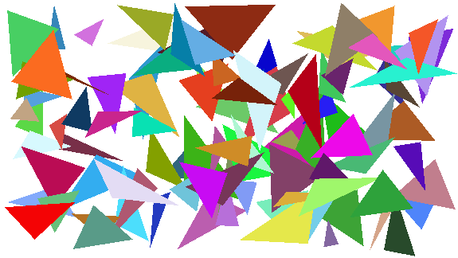
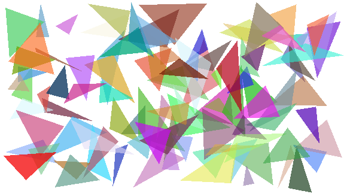

# 可选任务

如果你对Computer Graphics感兴趣，那么可以考虑看一下。

## 实现三角形的光栅化

给定图片的宽度和高度，以及一些三角形，按照顺序对其进行光栅化并且生成图片。

要求实现`./main.cpp`里面的`drawTriangle`函数(不限于，你可以对其他代码进行改动)。编译`main.cpp`并且运行它，可以得到生成的图片(png格式)。输入的数据文件为`./data`。当然可以自己使用其他方法来生成。

## 输入格式

- 第一行三个无符号整型`n`, `width`, `height`表示三角形的总个数，以及图片的宽度和高度。
- 接下来`n`行6个浮点数`v0_x`, `v0_y`, `v1_x`, `v1_y`, `v2_x`, `v2_y`分别表示三角形三个顶点的位置(`v0`, `v1`, `v2`)。
- 原点为图片的左上角，输入端点或者顶点先输入x然后输入y坐标。
- 输入的三角形的顶点是逆时针顺序的(如果没出错的话)。

## 输出格式

输出一张图片。

## 提交

提交多张图片(1-3张)，其中一张为提供的数据渲染的图片，另外两张可以任意渲染。以及用于生成图片的代码文件(使用提供的`main.cpp`的话则是提交自己实现后的`main.cpp`，否则则取决于你生成图片的方式，但是取巧的方法可不行)。

## Example

简单的渲染三角形

使用混合渲染的三角形

使用抗锯齿渲染的三角形

